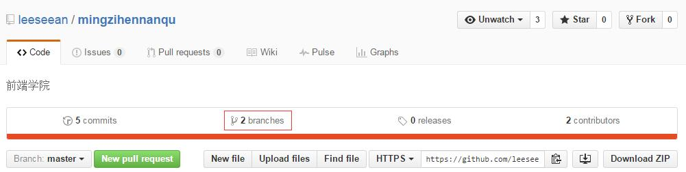

# Git 基本使用
## 建立自己的分支
进入项目目录，我们会处在 master 分支下：

```
projectName (master)
```

我们不能同时在 master 分支下进行编辑和提交，这样会把整个代码改的非常乱。我们要做的第一件事是，保证各自的代码独立，互相不会干扰。为了达成这个目的，需要建立自己的分支：

```
git checkout -b your-name // 用自己的名字建一个新分支 
```

此时提示符会变为：

```
projectName (your-name)
```

此时就建立并进入了自己的分支，这个分支叫 your-name。可以在 master 和 your-name 两个分支间自由的切换：

```
git checkout master      // 进入 master 分支
git checkout your-name   // 进入自己的分支
```

当你在自己的分支中，编辑文件，比如 README.md，编辑完成、保存、add、commit 之后，再切换回 master 分支，会发现 master 分支的 README.md 内容依然保持原样。

简单的说，**你的分支是 master 分支的一个副本，和 master 完全一样、完全隔离**，在自己分支中可以任意修改代码，都不会对其他人造成影响。这就保证了我们代码的各自独立。

## 编写代码
建立分支后，就可以在自己分支中开始任务的代码编写。编写过程中，正常的进行 add 和 commit，保存自己的改动。
```
git add .   // 添加所有的修改
git commit -m "在这里为改动做简单的注释"
```

## 提交分支
当需要将自己的代码提交到 github 库中时，会和普通的 push 有所不同：
```
git push origin your-name  // 提交一个新的分支
```

## 查看队友的代码
在任务完成后或过程中，都会需要看看队友的代码。我们可以直接在 github 网页中，点击 branches 标签：

然后点击其他队友的分支，即可看到代码。

## 最终代码的合并
我们每个人会在自己的分支里进行编写，然后提交自己的分支。每个人都编写完成后，经过讨论修改，我们会把最终的代码 merge 到 master 分支上。

